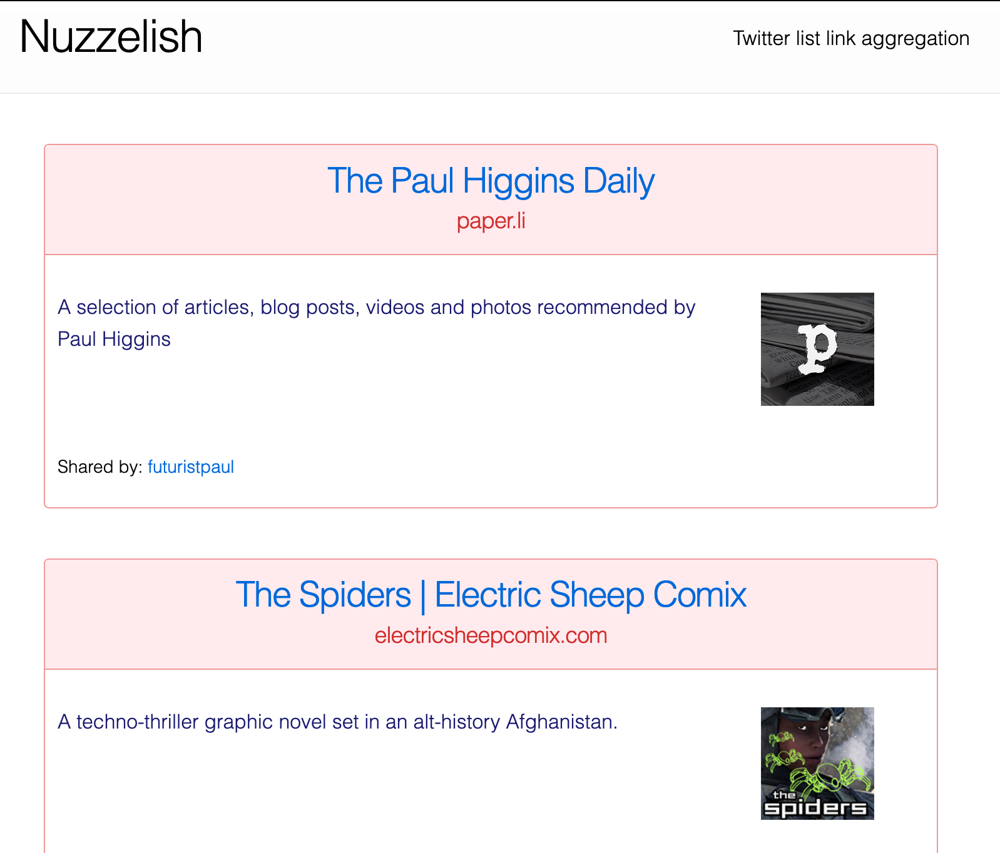

# Nuzzelish

To start your Phoenix server:

  * Install dependencies with `mix deps.get`
  * Create and migrate your database with `mix ecto.setup`
  * Install Node.js dependencies with `cd assets && npm install`
  * Start Phoenix endpoint with `mix phx.server`
  * Start IEX with the app contents ready with `iex -S mix phx.server`
  * Set env vars for `TW_ACCOUNT` and `TW_LIST`, as well as Twitter app creds:
    - `TW_CONSUMER_KEY`
    - `TW_CONSUMER_SECRET`
    - `TW_ACCESS_TOKEN`
    - `TW_ACCESS_TOKEN_SECRET`

Now you can visit [`localhost:4000`](http://localhost:4000) from your browser.

Ready to run in production? Please [check our deployment guides](https://hexdocs.pm/phoenix/deployment.html).

## Developing

- Get the Postgres database going: `$ mix ecto.create && mix ecto.migrate`
- Connect to the dev Postgres instance with `\connect nuzzelish_dev` after
  running `$ psql -U postgres`

## Learn more

  * Official website: http://www.phoenixframework.org/
  * Guides: https://hexdocs.pm/phoenix/overview.html
  * Docs: https://hexdocs.pm/phoenix
  * Mailing list: http://groups.google.com/group/phoenix-talk
  * Source: https://github.com/phoenixframework/phoenix
